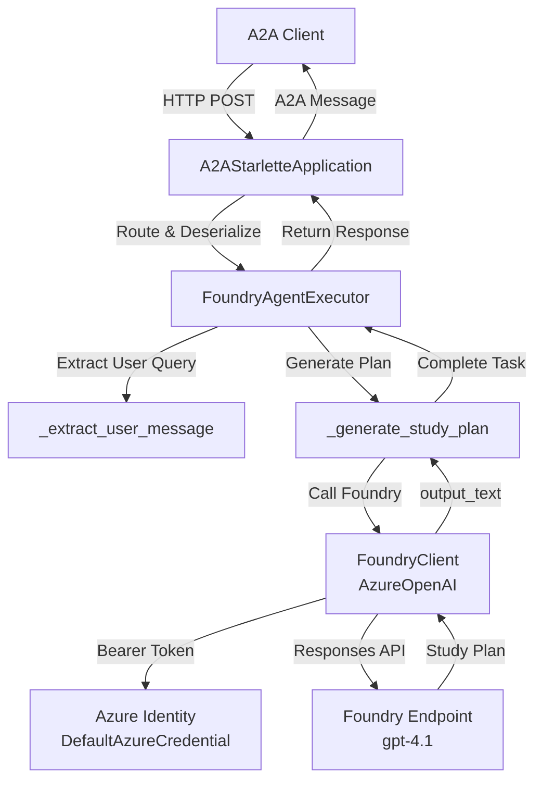

# Azure AI Study Planner Agent

<div align="center">

[](https://www.python.org)
[](https://azure.microsoft.com/en-us/services/ai-foundry/)
[](https://github.com/microsoft/a2a)
[](LICENSE)

**An intelligent study plan generator powered by Microsoft Azure Foundry and the A2A protocol**

[Features](#features) • [Setup](#setup) • [Usage](#usage) • [Architecture](#architecture)

</div>

---

## Overview

This project demonstrates a production-ready AI agent that generates structured, personalized study plans using **Microsoft Azure Foundry** and the **A2A (Agent-to-Agent) communication protocol**. The agent provides educational guidance with real-world context and professional tone suitable for university learners and career-focused professionals.

## Features

- ✅ **Structured Study Plans** - Generates multi-phase learning paths with progression from basics to advanced topics
- ✅ **Real-World Context** - Explains why each topic matters in professional environments
- ✅ **A2A Protocol Support** - Full remote agent communication via the A2A protocol
- ✅ **Azure Foundry Integration** - Leverages Foundry's gpt-4.1 model with managed inference
- ✅ **Professional Tone** - Outputs crafted to feel like guidance from experienced mentors
- ✅ **Health Monitoring** - Built-in health check endpoint for observability
- ✅ **Async-First** - Non-blocking request handling with full async/await support

## Architecture



## Setup

### Prerequisites

- **Python 3.10+**
- **Azure Subscription** with access to Azure AI Foundry
- **Azure CLI** authenticated: `az login`
- **Environment variables** configured (see `.env.example`)

### Installation

1. **Clone or download** this repository:
```bash
cd 09-build-remote-agents-with-a2a/python
```

2. **Create virtual environment** (optional but recommended):
```bash
python -m venv labenv
.\labenv\Scripts\activate  # Windows
# or
source labenv/bin/activate  # macOS/Linux
```

3. **Install dependencies**:
```bash
pip install -r requirements.txt
```

4. **Configure environment**:
Create a `.env` file with:
```env
FOUNDRY_AGENT_ENDPOINT=https://your-resource.services.ai.azure.com/api/projects/your-project/agents/agente/endpoint/protocols/openai/responses
FOUNDRY_API_VERSION=2024-10-21
SERVER_URL=localhost
TITLE_AGENT_PORT=10007
```

## Usage

### Start the Agent Server

```bash
python -m title_agent.server
```

Server will start on `http://localhost:10007/`

### Health Check

```bash
curl http://localhost:10007/health
# Response: "Study Planner Agent is running!"
```

### Request a Study Plan

Using any A2A-compatible client or cURL:

```bash
curl -X POST http://localhost:10007/openai/responses \
  -H "Content-Type: application/json" \
  -d '{
    "model": "agente",
    "messages": [
      {
        "role": "user",
        "content": "Create a study plan for learning Python data science from scratch"
      }
    ]
  }'
```

### Example Response

```
Study Planner Agent is processing your request...

# Python Data Science Learning Path

## Why This Matters
Data science is one of the most in-demand skills in tech. Companies across finance, 
healthcare, and tech rely on professionals who can extract insights from data...

## Phase 1: Python Fundamentals (Weeks 1-2)
- Core syntax and data types
- Functions, modules, and packages
- Exception handling
- [Projects]: Build a CLI calculator

## Phase 2: Data Manipulation (Weeks 3-4)
- NumPy arrays and operations
- Pandas DataFrames and analysis
...
```

## Project Structure

```
title_agent/
├── server.py              # A2A HTTP server with Starlette
├── agent_executor.py      # Core request processing and plan generation
├── foundry_client.py      # Azure Foundry API client wrapper
├── agent.py               # Legacy Azure AI Agents implementation (reference)
└── __init__.py            # Package initialization

requirements.txt           # Python dependencies
.env                      # Environment configuration (not in repo)
```

## Key Components

### `FoundryAgentExecutor`
Implements the A2A `AgentExecutor` interface:
- Handles incoming A2A requests
- Extracts user queries from message parts
- Calls Foundry with optimized instructions
- Manages task lifecycle (submit → working → complete/failed)

### `FoundryClient`
Wrapper around `AzureOpenAI` with:
- Azure identity-based authentication (no hardcoded credentials)
- Bearer token provider setup
- Responses API client initialization
- Clean separation of concerns

### `server.py`
Sets up:
- Agent card for service discovery
- Available skills definition
- Health check endpoint
- Starlette + Uvicorn HTTP server
- A2A routing and task management

## Performance Notes

- **First-request latency**: ~2-5 seconds (Foundry model loading)
- **Subsequent requests**: ~1-2 seconds
- **Typical response size**: 1.5-3KB (study plan)
- **Token efficiency**: ~300-600 tokens per generated plan

## Security

✅ **No hardcoded credentials** - Uses Azure Identity for authentication  
✅ **No file persistence** - All operations are stateless and in-memory  
✅ **Secure token handling** - Bearer tokens managed by Azure SDK  
✅ **CORS-safe** - Designed for cross-origin A2A communication  

## Troubleshooting

| Issue | Solution |
|-------|----------|
| `401 Unauthorized` | Run `az login` and verify FOUNDRY_AGENT_ENDPOINT |
| `Empty response` | Check Foundry agent is deployed; verify `agente` model exists |
| `Port already in use` | Change `TITLE_AGENT_PORT` in `.env` |
| `Connection timeout` | Ensure Foundry endpoint is accessible from your network |

## Next Steps

1. **Integrate with Teams** - Use this agent in Microsoft Teams workflows
2. **Add Tool Calling** - Extend with OpenAPI tools for interactive learning
3. **Multi-Agent Orchestration** - Combine with other agents (routing_agent, outline_agent)
4. **Custom Knowledge Base** - Fine-tune Foundry with domain-specific study guides
5. **Caching Layer** - Add Redis for frequently requested topics

## Contributing

This is a learning project for the Microsoft AI Agents course. Feedback and improvements are welcome!

## License

MIT License - See LICENSE file for details.

---

<div align="center">

**Built with ❤️ using Microsoft Azure Foundry and the A2A Protocol**

[Microsoft Learn](https://learn.microsoft.com/en-us/azure/ai-services/agents/) • [Azure Foundry Docs](https://learn.microsoft.com/en-us/azure/ai-studio/how-to/agents-overview) • [A2A GitHub](https://github.com/microsoft/a2a)

</div>
